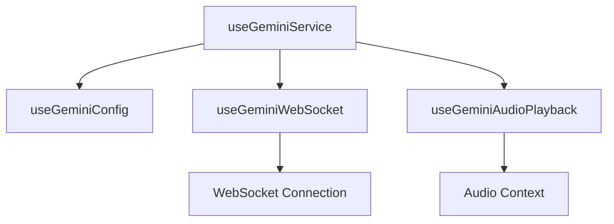

# Unified Gemini Service Hooks

This directory contains a unified set of hooks for interacting with Google's Gemini API, providing both chat and audio capabilities.

## Architecture



## Core Hooks

### useGeminiService
Main hook for interacting with Gemini. Combines chat and audio capabilities.

```typescript
const {
  messages,        // Chat history
  isLoading,       // Loading state
  isPlaying,       // Audio playback state
  error,           // Error state
  sendMessage,     // Send message to Gemini
  stopAudio,       // Stop audio playback
  clearMessages    // Clear chat history
} = useGeminiService({
  onError: (error) => console.error(error)
});
```

### useGeminiConfig
Manages Gemini API configuration and credentials.

```typescript
const { apiKey, modelName } = useGeminiConfig();
```

### useGeminiWebSocket
Handles WebSocket connections for real-time communication.

```typescript
const {
  isConnected,
  sendMessage,
  error
} = useGeminiWebSocket({
  onTextMessage: (text) => console.log(text),
  onAudioChunk: (chunk) => handleChunk(chunk)
});
```

### useGeminiAudioPlayback
Manages audio playback from streamed responses.

```typescript
const {
  isPlaying,
  handleAudioChunk,
  playAudioChunks,
  stopAudio
} = useGeminiAudioPlayback();
```

## Usage Example

```tsx
import { useGeminiService } from '@/hooks/gemini';

function MyComponent() {
  const {
    messages,
    isLoading,
    sendMessage
  } = useGeminiService({
    onError: (error) => {
      console.error('Gemini error:', error);
    }
  });

  return (
    <div>
      {messages.map((msg) => (
        <div key={msg.timestamp}>
          {msg.content}
        </div>
      ))}
      <button 
        onClick={() => sendMessage('Hello!')}
        disabled={isLoading}
      >
        Send Message
      </button>
    </div>
  );
}
```

## Configuration

Set your Gemini API key in one of two ways:

1. Environment variable:
```env
VITE_GEMINI_API_KEY=your_api_key_here
```

2. Local storage:
```javascript
localStorage.setItem('GEMINI_CONFIG', JSON.stringify({
  apiKey: 'your_api_key_here',
  modelName: 'gemini-2.0-flash'
}));
```

## Notes

- The hooks handle automatic reconnection for WebSocket connections
- Audio playback is automatically managed based on streamed responses
- All hooks include proper cleanup on unmount
- TypeScript types are available for all exports
